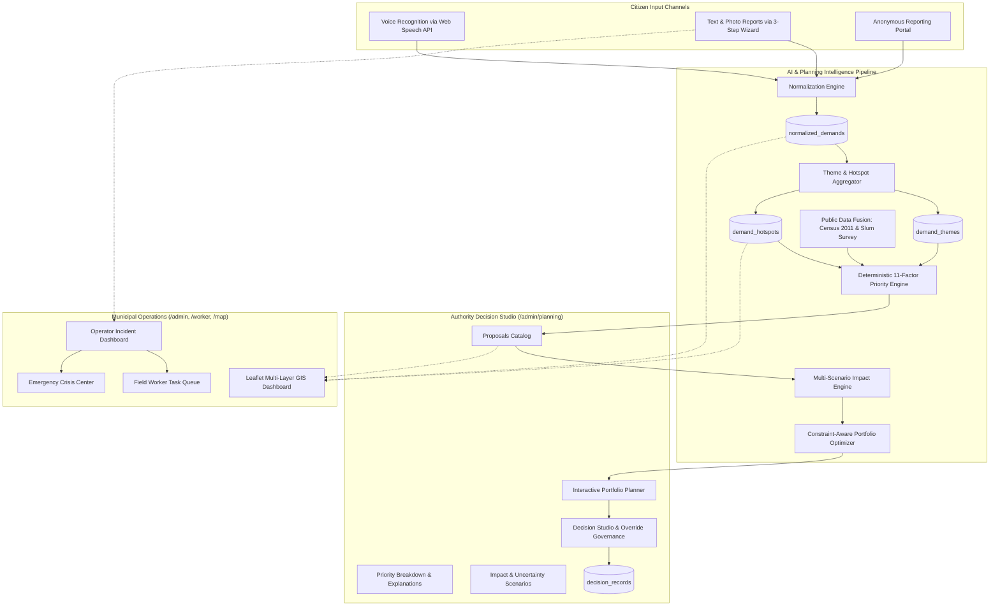

# CivicLens AI Operating System & Development Planning Platform — Technical Documentation

## 1. Executive Summary

CivicLens unifies everyday municipal operations (citizen reporting, field technician dispatch, and emergency response) with high-level **Constituency Development Planning Intelligence**. It specifically addresses the problem statement:

> **"People's Priorities: AI for Constituency Development Planning"**

Demonstrated using official ward datasets for the **Bhubaneswar Municipal Corporation (BMC)**, CivicLens converts fragmented citizen complaints and voices into structured, prioritized, and constraint-optimized capital expenditure proposals.

---

## 2. System Architecture



---

## 3. Database Schema (`civiclens.db`)

CivicLens uses SQLite (`better-sqlite3`) configured with Write-Ahead Logging (`WAL`) and foreign keys for high performance and zero configuration overhead.

### Core Incident Tables
- `users`: ID, name, email, role (`CITIZEN`, `OPERATOR`, `WORKER`), avatar.
- `departments`: ID, name, description (e.g. Public Works, Sanitation, Water Supply, Health).
- `workers`: ID, name, status (`Available`, `Busy`, `Offline`), department_id, latitude, longitude.
- `complaints`: ID, category, priority, severity, summary, status (`Pending`, `In Progress`, `Resolved`), department, estimated_resolution_time, worker_id, latitude, longitude, image_url, created_at.
- `emergencies`: ID, type, location, status (`Active`, `Resolved`), severity, reported_at.

### Constituency Development Planning Tables
- `normalized_demands`: ID, civic_input_id, category, sub_category, title, summary, demand_statement, problem_statement, severity, urgency, language, ward_id, lat, lng, confidence, affected_groups (JSON), citizen_id, source, created_at.
- `demand_themes`: ID, name, summary, category, sub_category, recurrence_status (`HIGH`, `MEDIUM`, `EMERGING`), demand_count, unique_citizen_count, coherence_score, representative_demand_id, representative_statement, first_observed_at, last_observed_at.
- `demand_hotspots`: ID, ward_id, center_lat, center_lng, radius, demand_count, unique_citizen_count, dominant_category, intensity (`CRITICAL`, `HIGH`, `MEDIUM`), recurrence, geographic_concentration, confidence, status, first_observed_at, last_observed_at.
- `datasets`: ID, name, source, geographic_level, description, record_count, last_updated, provenance.
- `development_proposals`: ID, title, description, category, sub_category, ward_id, lat, lng, estimated_cost, estimated_timeline, beneficiaries, target_groups (JSON), dependencies (JSON), status, priority_score, social_impact_score, economic_impact_score, economic_impact_level, created_at.
- `priority_assessments`: ID, proposal_id, total_score, factors_json, weights_json, explanation_json, calculated_at.
- `impact_assessments`: ID, proposal_id, social_impact_score, economic_impact_score, economic_impact_level, social_factors_json, economic_factors_json, scenarios_json, assumptions_json, uncertainty, uncertainty_reasons_json, confidence, calculated_at.
- `development_portfolios`: ID, name, max_budget, selected_proposals_json, excluded_proposals_json, total_allocated, remaining_budget, created_at.
- `decision_records`: ID, portfolio_id, approved_proposals_json, human_overrides_json, justification, approved_by, total_cost, remaining_budget, approved_at.
- `audit_logs`: ID, action, entity_type, entity_id, user_name, details_json, timestamp.

---

## 4. Planning Engines Specification

### 4.1 Demand Normalization Engine (`normalizationEngine.js`)
Transforms raw text or transcribed voice into standardized civic demand entities:
- Extracts: `category`, `subCategory`, `title`, `summary`, `demandStatement`, `problemStatement`, `severity`, `urgency`, `wardId`, `affectedGroups`, and `confidence`.
- Maps colloquial references to official BMC wards (e.g. "Harish Vihar / Bhouma Nagar" $\rightarrow$ `Ward 23`, "Rasulgarh" $\rightarrow$ `Ward 35`, "Saheed Nagar" $\rightarrow$ `Ward 24`, "Nayapalli" $\rightarrow$ `Ward 42`).

### 4.2 Theme & Hotspot Clustering Engine (`themeHotspotEngine.js`)
- **Theme Aggregation**: Groups demands sharing categorical and sub-categorical coherence, calculating unique citizen reach, recurrence frequency, and representative demands.
- **Hotspot Detection**: Calculates spatial density by ward, computing an `intensity` score based on demand count, unique citizen count, and severity weights.

### 4.3 Deterministic 11-Factor Priority Engine (`priorityEngine.js`)
Scores proposals from 0 to 100 using fixed mathematical weights:

| Factor | Weight | Evaluation Criteria |
| :--- | :---: | :--- |
| `demandStrength` | 16% | Aggregate count and intensity of linked citizen demands |
| `uniqueCitizenReach` | 14% | Number of distinct, verified citizen submissions |
| `recurrence` | 12% | Persistence and repetition of the demand over time |
| `geographicConcentration` | 10% | Spatial density and clustering in the target ward |
| `contextualEvidence` | 10% | Corroborating public datasets (Census, Slum surveys) |
| `infrastructureGap` | 10% | Distance to nearest facility or missing baseline coverage |
| `urgency` | 8% | Immediacy of need (e.g., monsoon flooding risk, water outage) |
| `severity` | 6% | Magnitude of disruption (e.g., critical hazard vs cosmetic) |
| `affectedPopulation` | 5% | Total census population benefiting in the ward |
| `equityVulnerability` | 5% | Focus on marginalized populations (slum dwellers, SC/ST, low literacy) |
| `evidenceConfidence` | 4% | Source authenticity and recency of available datasets |

$$\text{Total Score} = \sum_{i=1}^{11} \left( w_i \times \text{normalized\_factor}_i \right)$$

### 4.4 Multi-Scenario Impact Engine (`impactEngine.js`)
Models project outcomes across three scenarios to provide transparent risk boundaries:
- **Conservative**: Lower bound assuming operational delays or conservative uptake (0.65x multiplier).
- **Base**: Expected outcome based on baseline census catchment data (1.00x multiplier).
- **Optimistic**: Upper bound assuming catalytic economic and social spillovers (1.35x multiplier).
- Declares explicit **Assumptions** and **Uncertainty Reasons** (e.g. *"Assumes regular desilting maintenance by BMC"*).

### 4.5 Constraint-Aware Portfolio Optimizer (`portfolioOptimizer.js`)
Solves capital allocation under municipal constraints using a deterministic Greedy Value/Cost ratio algorithm:
- **Objective Function**: Maximize $\sum \text{PriorityScore}_i \times \text{ImpactScore}_i$
- **Subject to**: $\sum \text{Cost}_i \le \text{Budget}$ (Default: ₹5.00 Cr)
- **Category Balancing**: Limits capital concentration in any single sector to ensure balanced constituency growth.
- **Auditable Exclusions**: For every unselected project, provides explicit rationales (`BUDGET_EXCEEDED`, `CATEGORY_LIMIT_REACHED`, `LOWER_PRIORITY_RANK`).

---

## 5. REST API Reference

The backend operates on `http://localhost:3000`:

| Method | Endpoint | Description |
| :--- | :--- | :--- |
| `GET` | `/api/planning/demands` | Returns all normalized demands with affected demographics. |
| `POST` | `/api/planning/demands/normalize` | Real-time AI normalization of raw text/voice inputs into structured demands. |
| `GET` | `/api/planning/themes` | Aggregated demand themes with recurrence status and coherence scores. |
| `GET` | `/api/planning/hotspots` | Geospatial hotspots with demand counts, intensity, and dominant category. |
| `GET` | `/api/planning/datasets` | Ingested official datasets metadata and provenance records. |
| `GET` | `/api/planning/demographics` | Ward-level Census 2011 demographics for all 67 BMC wards. |
| `GET` | `/api/planning/demographics/:wardId` | Demographic and slum profile for a specific ward. |
| `GET` | `/api/planning/evidence/:proposalId` | Corroborating evidence records (`SUPPORTING`, `CONTRADICTING`, `NEUTRAL`, `INSUFFICIENT_DATA`). |
| `GET` | `/api/planning/proposals` | Evaluated development proposals ranked by priority score. |
| `GET` | `/api/planning/priority/:proposalId` | Detailed 11-factor breakdown, weights, and explanations for a proposal. |
| `GET` | `/api/planning/impact/:proposalId` | Multi-scenario impact assessment (Conservative, Base, Optimistic). |
| `POST` | `/api/planning/portfolio/optimize` | Solves portfolio selection given max budget (e.g. ₹5.0 Cr) and returns selected + excluded proposals with explanations. |
| `GET` | `/api/planning/decisions` | Retrieves permanent decision history. |
| `POST` | `/api/planning/decisions` | Validates, approves, and records a final portfolio with human override justifications. |
| `POST` | `/api/auth/aadhaar-verify` | Ported from `civic_v3`: verifies password-protected e-Aadhaar PDF files. |
| `GET` | `/api/planning/ai-context` | Grounding endpoint providing high-level metrics for Gemini AI context injection. |

---

## 6. End-to-End Demonstration Script

To demonstrate the full constituency planning workflow:

1. **Step 1 (Citizen Voice)**: Open the **AI Hub** or **Report Issue** tab. Submit: *"Road near Harish Vihar gets flooded every monsoon and there is no proper drainage."*
2. **Step 2 (Normalization)**: The system normalizes the input into `Ward 23 Stormwater Drainage` with `HIGH` severity and `0.92` extraction confidence.
3. **Step 3 (Themes & Recurrence)**: Navigate to `/admin/planning` $\rightarrow$ **Themes & Recurrence**. Observe the theme *"Monsoon Flood Drainage Infrastructure Demands"* accumulating multiple citizen inputs.
4. **Step 4 (Geographic Hotspot)**: Switch to **Demand Hotspots** or the **Live Map**. Ward 23 appears with a pulsing red `CRITICAL` intensity hotspot.
5. **Step 5 (Evidence Inspection)**: Click the **Public Data & Evidence** tab. Inspect Ward 23 Census 2011 data (Population: 14,280) and BMC Slum Survey records (14 notified slum clusters) supporting the need.
6. **Step 6 (Priority Evaluation)**: Open **Priority Engine**. View the transparent score of **87.4 / 100** with exact mathematical factor contributions.
7. **Step 7 (Impact Assessment)**: View **Impact Assessment** for 3-scenario projections (Base: 42,000 citizens reached, 65% waterlogging reduction).
8. **Step 8 (Portfolio Optimization)**: Go to **Portfolio Optimizer**. Set budget to ₹5.00 Cr and click **Run Optimization**. The engine selects 4 projects totaling ₹4.80 Cr and logs explicit exclusion reasons for remaining proposals.
9. **Step 9 (Authority Override & Decision Record)**: In **Decision Studio**, add an override, enter a mandatory justification (*"Critical municipal monsoon preparedness priority"*), and click **Approve Portfolio**. The system creates an immutable `DecisionRecord`.

---

## 7. Development & Verification

### Running the Application
```bash
# Install packages
npm install

# Start both frontend (5174) and backend (3000)
npm run dev

# Run production build validation
npm run build
```

### Truthfulness & Standards Compliance
- **Zero Hallucinated Metrics**: All priority scores, budget calculations, and scenario forecasts are calculated deterministically by server-side engines.
- **Authentic Attribution**: Demographics and slum statistics are derived from official Bhubaneswar municipal records.
- **WCAG AA Compliance**: High-contrast, large-text, and reduced-motion settings are respected across all newly introduced planning interfaces.

---

## 8. Real-Time Hotspots, DB Seeding & Aadhaar Verification Architecture

### 8.1 Real-Time Hotspot Marking (Strict 100m Radius)
- **Dynamic Recomputation**: Whenever an issue or complaint is reported via `POST /api/complaints`, the backend normalizes the demand immediately via `NormalizationEngine.normalizeRawVoice()`.
- **Spatial Aggregation**: `ThemeHotspotEngine.computeHotspots()` groups co-located demands within Bhubaneswar wards and recomputes `demand_hotspots`.
- **Exact Radius (100m)**: Every generated hotspot strictly enforces `radius: 100` meters in compliance with BMC localized ward jurisdiction standards.
- **Instant Map Reflection**: Frontend query caches on `/map` are invalidated upon report submission, triggering immediate re-render of Leaflet glowing hotspot rings without requiring a full page refresh.

### 8.2 Direct Database Seeding & Zero Frontend Mock Data
- **Central SQLite Database (`civiclens.db`)**: All mock datasets previously housed in client-side arrays (`src/utils/mock-data.ts`) have been completely decoupled and seeded directly into SQLite.
- **Authentic Municipal Tables**:
  - `services`: 8 authentic BMC citizen services (Birth/Death Certificates, Property Tax, Trade License, Building Permission, Water Connection, Septage Cleaning, Grievance Escalation).
  - `civic_rewards`: 6 authentic Bhubaneswar rewards (Mo Bus & CRUT Metro Pass, BMC Smart Parking, Odisha State Central Library Access, Kalinga Stadium Sports Entry, Smart Kiosk Voucher, Town Hall Delegate Seat).
  - `reward_redemptions`: Audit logs of redemptions with generated voucher codes.
  - `notifications`: Ward advisories, transit updates, and security alerts.
  - `user_activities`: Timestamped citizen participation timeline with point credits.
- **REST Endpoints**: Fully wired to `GET /api/services`, `POST /api/services/apply`, `GET /api/rewards`, `POST /api/rewards/redeem`, `GET /api/notifications`, `GET /api/users/:id/profile-stats`, `GET /api/dashboard/stats`.

### 8.3 Citizen Registration with e-Aadhaar KYC Verification
- **Cryptographic Validation**: `server/services/aadhaarVerifier.js` validates uploaded e-Aadhaar PDFs by scanning for standard UIDAI embedded digital signature dictionaries (`/Type /Sig`, `/ByteRange`, PKCS#7 structures).
- **Password Derivation**: Automatically calculates the standard UIDAI Aadhaar password format (`FIRST4NAME_UPPERCASE + YYYY`) based on citizen's full name and DOB.
- **Automated Provisioning**:
  - Automatically awards **+100 Welcome Civic Points** upon verification.
  - Sets `aadhaar_verified = 1` and marks timestamp `aadhaar_verified_at`.
  - Creates an audit record in `user_activities` and sends a welcome notification to the user's notification inbox.
  - Automatically logs the citizen into the application with full access to the Citizen Dashboard.

